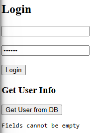
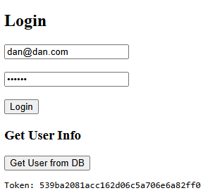
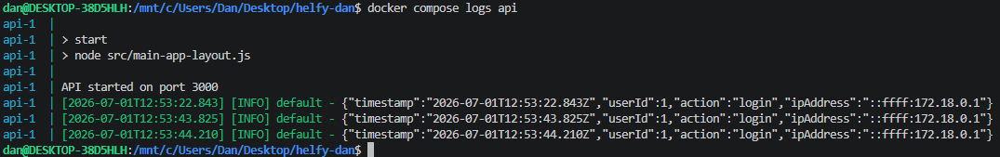
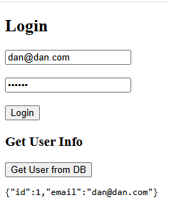
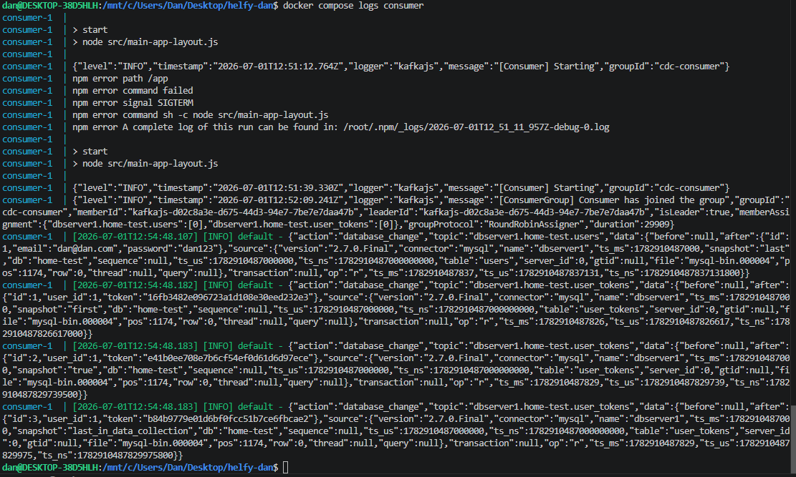
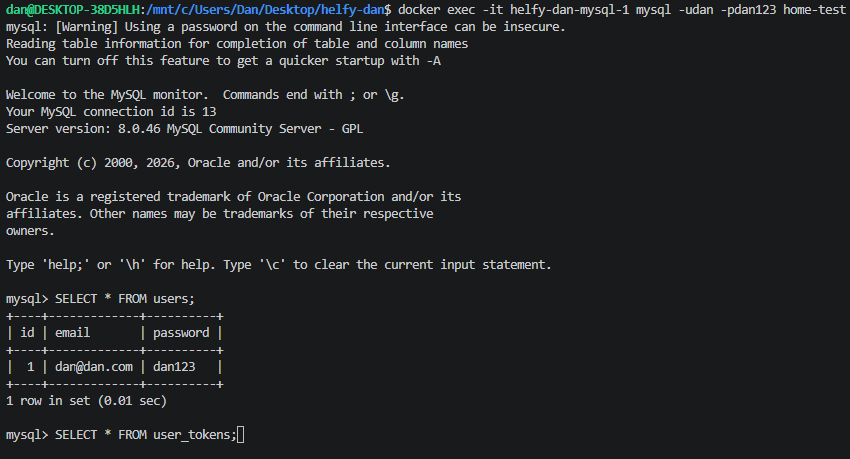
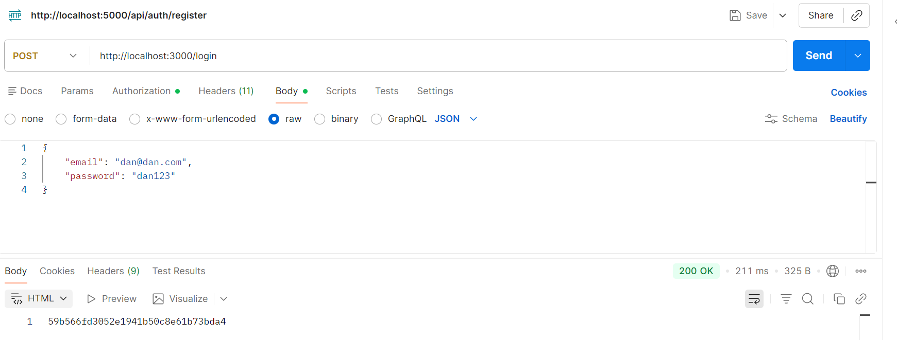
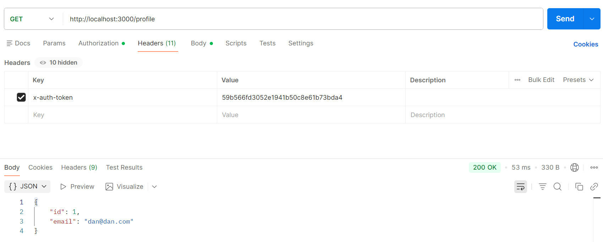

# Login & Database Monitoring Project

This is a simple home assignment that sets up a basic login page, stores session tokens in a database, and captures database changes in real-time using Debezium and Kafka.

> [!NOTE]
> **Database & CDC Compatibility:**
> The PDF requirements specify MySQL with Debezium, while the email mentions TiDB CDC. Since TiDB is 100% protocol-compatible with MySQL, the application code works natively with both. For local development, we use the MySQL/Debezium setup.

---

## How It Works

Here is a quick flow of how the data moves:

**Browser (Frontend) -> API (Backend) -> MySQL Database -> Debezium -> Kafka -> Consumer**

1. The frontend sends login credentials to the backend.
2. The backend validates the login and writes a new session token to MySQL.
3. Debezium watches MySQL for database inserts and forwards them to a Kafka topic.
4. A simple consumer app listens to Kafka and prints the database changes to the console.

---

## Prerequisites

You just need:
- Docker
- Docker Compose

---

## How to Run

1. Run the compose command:
   ```bash
   docker compose up --build
   ```
2. Open the page in your browser:
   http://localhost:8080

---

## Default Login Credentials
- **Email:** `dan@dan.com`
- **Password:** `dan123`

---

## Screenshots & Verification

Here are the screenshots showing that everything is working. You can find them in the `screenshots` folder.

### 1. Form Validation
If you leave fields empty and try to log in, you'll see a client-side warning:



---

### 2. Successful Login
Logging in with the default credentials returns a token to the browser:



---

### 3. API Logging (log4js)
When someone logs in, the API prints a JSON log to the console tracking the event:



---

### 4. Fetch User from DB (HTTP Header)
Clicking the "Get User from DB" button fetches the profile details using the token in the `x-auth-token` HTTP header:



---

### 5. Database Change Monitoring (CDC)
Here is the consumer console output showing that database changes are successfully captured and printed:



#### What is happening in the consumer logs:
- First, the consumer starts up (`[Consumer] Starting`) and connects to Kafka.
- Then, it locates the group coordinator and joins the consumer group (`Consumer has joined the group`).
- Finally, when a login occurs and a new token is added to the database, Debezium captures the change and the consumer prints it out (`database_change` JSON containing the inserted row).

---

## Manual Testing (API & Database)

You can manually verify the system endpoints and database records.

### 1. Database Verification
After a user logs in, you can connect to the database to view the `users` and `user_tokens` tables. 

You can connect directly via the running Docker container:
```bash
docker exec -it helfy-dan-mysql-1 mysql -udan -pdan123 home-test
```

Or using any external DB client with the following details:
- **Host:** `localhost`
- **Port:** `3306`
- **Username:** `dan` (or `root`)
- **Password:** `dan123`
- **Database:** `home-test`



---

### 2. Postman API Testing
You can also interact directly with the API using Postman:

- **POST `/login`:** Send `{"email":"dan@dan.com", "password":"dan123"}` (as JSON) to `http://localhost:3000/login` to retrieve a token.


- **GET `/profile`:** Send a request to `http://localhost:3000/profile` with the `x-auth-token` header to fetch the user profile.

